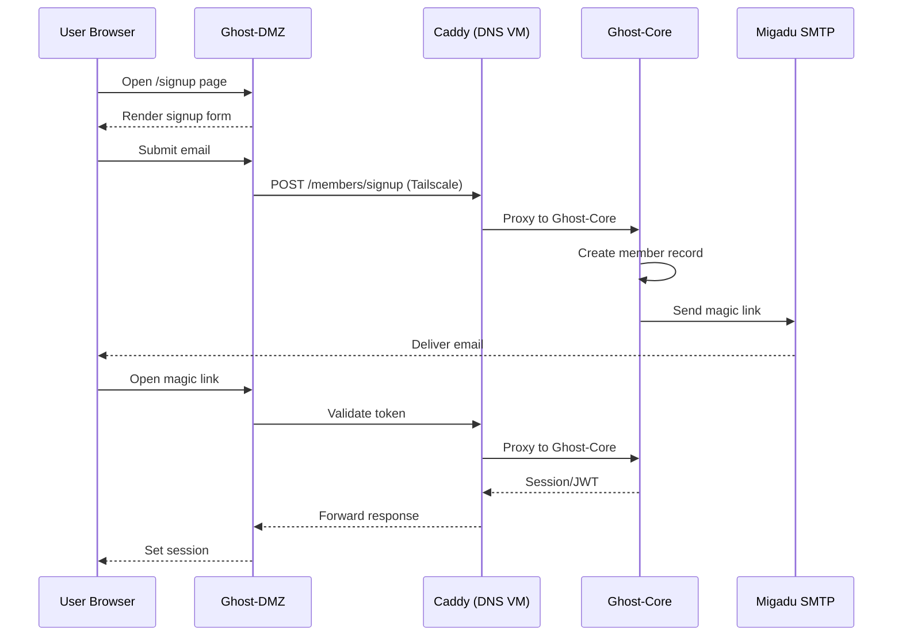
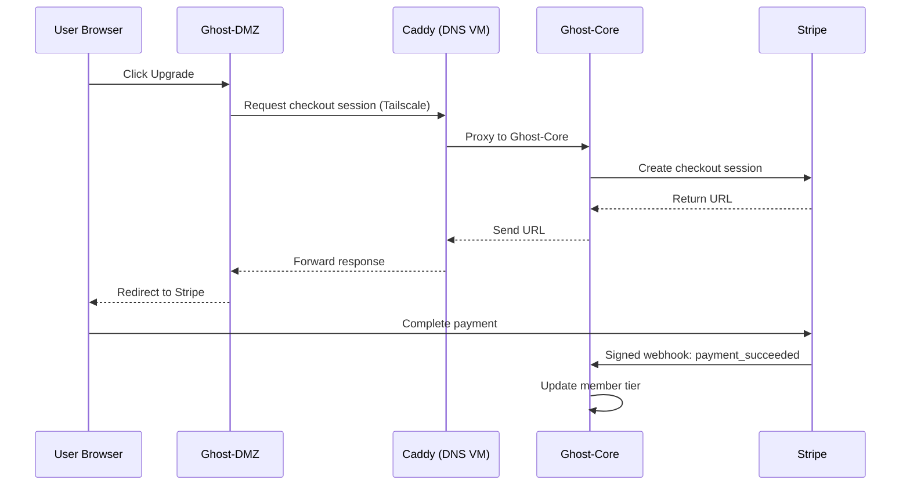
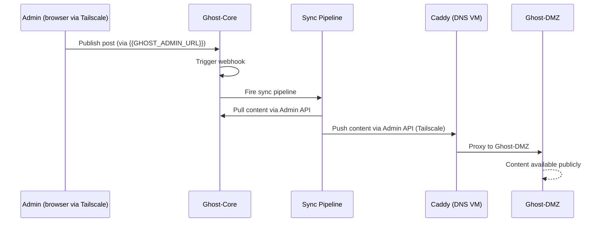

# Ghost Architecture — Ghost-Core + Ghost-DMZ

## 1. Purpose

This document describes the architecture for deploying Ghost across
Ghost-Core (trusted, internal) and Ghost-DMZ (untrusted, public-facing)
on the {{MY_DOMAIN}} homelab infrastructure. It covers the rationale,
alternatives considered, network routing decisions, and all data flows.

---

## 2. Why This Architecture

### The Problem

Running a single public-facing Ghost instance creates a direct path from
the internet to the database, admin panel, member data, and payment
webhooks. A vulnerability in Ghost, a misconfigured tunnel, or a
compromised admin credential would give an attacker access to everything
in one step.

### The Solution: Ghost-Core + Ghost-DMZ Split

Ghost-Core runs internally on NODE, never exposed to the internet.
Ghost-DMZ sits in the DMZ, is publicly reachable via cloudflared, but
holds no secrets and has no admin access. Content flows one way —
outward from Ghost-Core to Ghost-DMZ via the Ghost Admin API, routed
through the DNS VM as the single controlled choke point.

### Pros

**Security**
- Admin panel, SQLite database, and member data never touch the
  public-facing machine
- Compromise of Ghost-DMZ yields nothing sensitive — no DB, no secrets,
  no admin credentials, no path back into the internal network
- Stripe webhooks delivered only to Ghost-Core — never exposed publicly
- Ghost-DMZ is stateless and disposable — wipe and redeploy with no data loss

**Resilience**
- Ghost-Core and its data survive DMZ failure entirely
- Content persisted on TrueNAS (CORE-NAS) — independent of both VMs
- Ghost-DMZ can be rebuilt from scratch in minutes

**Clean network boundary**
- Ghost-DMZ has no direct path into the internal network
- All DMZ → internal traffic routes through the DNS VM (Caddy) — consistent
  with the platform-wide network topology
- Sync is push-only, initiated by Ghost-Core
- Compromise flows one direction only — DMZ cannot pivot inward

**Separation of concerns**
- Ghost-Core handles all writes: authoring, members, payments, email
- Ghost-DMZ handles all reads: serving posts, themes, assets
- Each can be updated, restarted, or scaled independently

---

## 3. Alternatives Considered

### Single Ghost Instance (Public)
Run one Ghost install, expose it directly via cloudflared.

**Rejected because:** No security boundary. Admin, DB, and member data
all reachable from the same attack surface as the public site.

### Ghost-Core + Static Frontend (JAMstack)
Use Ghost-Core as a headless CMS. Build the frontend with Astro, Next.js,
Gatsby, or similar. Ghost publishes via webhook, frontend rebuilds to
static HTML pushed to DMZ or a CDN.

**Pros:** Tiny DMZ attack surface (just static files), extremely fast
page loads, no running application on DMZ.
**Cons:** Requires building and maintaining a custom frontend. No
built-in Ghost membership/subscription UI. More complex build pipeline.
**Status:** Valid future migration path if more frontend control is needed.
Ghost-Core stays identical — only the head changes.

### Ghost-Core + Next.js / Nuxt (SSR)
Ghost-Core as headless, Next.js or Nuxt renders pages server-side on
request by calling the Ghost Content API live.

**Pros:** Dynamic rendering, personalisation possible, modern stack.
**Cons:** Heavier than static, requires maintaining a Node.js app on DMZ,
more moving parts.
**Status:** Not needed at current scale.

### Ghost-Core + WordPress Frontend
Use WordPress as the public-facing head, consuming Ghost Content API.

**Rejected because:** WordPress is heavier and historically has a larger
attack surface than Ghost. Adds unnecessary complexity for a personal site.

### Ghost-Core + Ghost-DMZ (Chosen)
Two Ghost instances. Ghost-Core is the authoritative backend.
Ghost-DMZ is a replica that receives content via Admin API sync.

**Pros:** No custom frontend needed. Full Ghost feature set on DMZ
including themes, membership UI, and rendering. Simple to operate.
**Cons:** Sync complexity — two live Ghost instances must be kept in
sync via API. Admin login requires Tailscale + DNS VM access.
**Status:** Implemented.

---

## 4. Network Routing Decision — DMZ to Ghost-Core

### Options Considered

**Option A — Ghost-DMZ talks directly to Ghost-Core over Tailscale**
```
Ghost-DMZ → Tailscale ACL → web VM ({{TS_WEB_IP}}:{{PORT}})
```
Simpler, fewer hops. But DMZ machine gets a direct Tailscale path into
an internal node — breaks the platform-wide principle that DMZ only
talks to the DNS VM.

**Option B — Ghost-DMZ talks to Ghost-Core via DNS VM (chosen)**
```
Ghost-DMZ → Tailscale → DNS VM → Caddy → web VM
```
Consistent with existing network topology. DNS VM is the single
controlled choke point for all DMZ → internal traffic. Logging,
rate-limiting, and access control in one place. Breaking this rule for
convenience sets a precedent and weakens the boundary.

**Decision: Option B.** Ghost-DMZ communicates with Ghost-Core only via
the DNS VM Caddy proxy. The Tailscale ACL allows DMZ → DNS VM only.
No direct DMZ → web VM path exists.

---

## 5. Architecture Diagram (End-to-End)

```mermaid
graph TD

    subgraph Internet
        UserBrowser[User Browser]
        Stripe[Stripe]
        EmailProvider[Migadu SMTP]
    end

    subgraph DMZ["DMZ — HP ProDesk 600 G3"]
        DMZGhost[Ghost-DMZ - Public Frontend]
        Cloudflared[cloudflared tunnel]
    end

    subgraph NODE["NODE — HP EliteDesk 800 G3"]
        WebVM[web VM 101]
        GhostCore[Ghost-Core - Backend]
        CoreDB[(SQLite DB)]
    end

    subgraph DNSVM["DNS VM (Internal)"]
        Caddy[Caddy Reverse Proxy]
        SplitDNS[Split DNS]
    end

    subgraph CORENAS["CORE-NAS — Minisforum N5Pro"]
        NFSShare[({{PATH}} - TrueNAS)]
        SyncJob[One-way API Sync Pipeline]
    end

    UserBrowser -->|HTTPS| Cloudflared
    Cloudflared --> DMZGhost

    DMZGhost -->|API calls via Tailscale| Caddy
    Caddy -->|proxy| GhostCore

    GhostCore --> CoreDB
    GhostCore -->|NFS over Tailscale| NFSShare
    GhostCore --> SyncJob
    SyncJob -->|Content only - Admin API - via Caddy| DMZGhost

    GhostCore -->|API| Stripe
    Stripe -->|Signed webhooks| GhostCore
    GhostCore -->|SMTP| EmailProvider

    UserBrowser -->|{{GHOST_ADMIN_URL}} - Tailscale only| SplitDNS
    SplitDNS --> Caddy
    Caddy -->|proxy admin| GhostCore
```

---

## 6. Network Topology

```mermaid
graph LR
    subgraph Public["Public Internet"]
        User[User]
        CF[Cloudflare DNS]
    end

    subgraph DMZ["DMZ Network"]
        ProDesk[HP ProDesk 600 G3]
        CFTunnel[cloudflared]
    end

    subgraph Tailscale["Tailscale Mesh"]
        DNSVM[DNS VM - Caddy + CoreDNS]
        WebVM[web VM - {{TS_WEB_IP}}]
        TrueNAS[{{TS_NAS_NAME}}]
    end

    User --> CF
    CF --> CFTunnel
    CFTunnel --> ProDesk
    ProDesk -->|Tailscale - DNS VM only| DNSVM
    DNSVM -->|proxy| WebVM
    WebVM -->|NFS over Tailscale| TrueNAS
```

---

## 7. Admin Access Flow

Ghost admin is accessed via `{{GHOST_ADMIN_URL}}` which resolves only on
Tailscale (split DNS). This avoids the session/cookie conflict caused by
accessing Ghost via raw Tailscale IP while `url` is set to the public domain.

```
Admin browser (Tailscale) → {{GHOST_ADMIN_URL}}
  → Split DNS resolves to DNS VM
  → Caddy proxies to http://{{TS_WEB_IP}}:{{PORT}}
  → Ghost-Core admin panel
```

No public DNS record for `{{GHOST_ADMIN_URL}}` exists. Unreachable from internet.

---

## 8. Sequence Diagram — Signup



---

## 9. Sequence Diagram — Paid Subscription



---

## 10. Sequence Diagram — Publish & Sync



---

## 11. Security Boundaries

| Boundary                  | Method                        | Notes                                        |
|---|---|---|
| Internet → DMZ            | Cloudflare + cloudflared      | No open inbound ports on DMZ                 |
| DMZ → DNS VM              | Tailscale (encrypted mesh)    | Only allowed DMZ → internal path             |
| DMZ → web VM (direct)     | Blocked                       | No Tailscale ACL — all traffic via DNS VM    |
| DNS VM → Ghost-Core       | Caddy reverse proxy           | Single choke point, loggable, rate-limitable |
| Ghost-Core → TrueNAS      | NFS over Tailscale            | Restricted to web VM Tailscale IP only       |
| Ghost-Core → Internet     | Outbound only (SMTP, Stripe)  | No inbound from internet to Ghost-Core       |
| Stripe → Ghost-Core       | Signed webhooks only          | Signature verified by Ghost                  |
| Admin → Ghost-Core        | Tailscale + split DNS + Caddy | {{GHOST_ADMIN_URL}} — no public DNS record     |

---

## 12. Hardware Summary

| Role       | Machine              | Key Specs                                          |
|---|---|---|
| CORE-NAS   | Minisforum N5Pro     | Ryzen AI 9 HX PRO 370, 96GB RAM, Arc B50 16GB GPU |
| NODE       | HP EliteDesk 800 G3  | i7-7700T ES, 32GB RAM, 480GB SSD                   |
| web VM     | VM 101 on NODE       | 2 vCPU, 6GB RAM, 48GB disk, Ubuntu 24.04           |
| DMZ        | HP ProDesk 600 G3 DM | i5-6500T, 16GB RAM, 256GB HDD                      |

---

## 13. Future Work

- Event-driven sync on publish via Ghost webhook (replace cron polling)
- Tailscale ACL hardening — minimal port allowlists per service
- Automated TrueNAS snapshots for Ghost-Core dataset
- Stripe + membership full integration and testing
- Evaluate static frontend (Astro/Next.js) if performance or design
  flexibility requirements grow
- Optional multi-region Ghost-DMZ replicas
